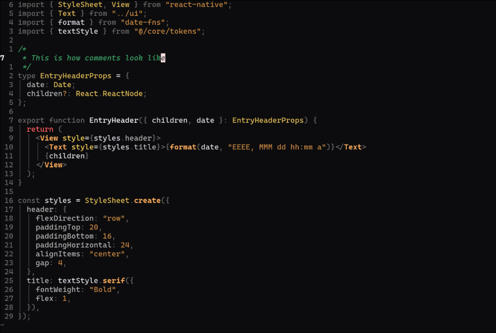

# intent.nvim

A warm, high-contrast Neovim colorscheme focused on what matters most to me when reading code.



## Installation

Install the theme with your package manager:

### [lazy.nvim](https://github.com/folke/lazy.nvim)

```lua
{
  "GasimGasimzada/intent.nvim",
  config = function()
    -- If you want to enable coloring for current cursor
    vim.o.cursorline = true

    vim.cmd.colorscheme("intent")
  end,
}
```

### Lualine integration

This theme is fully compatible with lualine. Just pass the theme to `setup` function:

```lua
require("lualine").setup({
  options = { theme = "intent" },
})
```

## Design

The palette is based on my favorite color and what's important in my code:

- Keywords like `const`, `type`, `import`, and brackets are intentionally dimmed.
- Emphasis goes to function calls, variables, values, types, operators, and comments.
- `return` is red because knowing return paths matters to me.

This keeps the focus on meaning for me rather than syntax noise.

## Compatibility

This theme is tested and compatible with the following languages and plugins:

### Languages

- [x] Javascript
- [x] Typescript
- [x] Nix
- [x] Markdown
- [ ] JSON

### Plugins

- [x] grug-far.nvim
- [x] blink.nvim
- [x] lualine.nvim
- [x] neotree.nvim
- [x] snacks.nvim picker (partial)
- [ ] snacks.lazygit (WIP)
